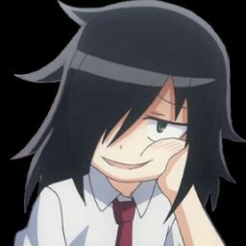

# get my page back
Fixes YouTube sidebar layout by moving the "My Page" section above the subscriptions block. Restores a more practical navigation order.

# how to use
To use this script you have to download the browser extension named 'Tampermonkey', or something like that. 

# also
i don't know why, for what reason, who aproved this, and furthermore — what drugs they were doing when they made that decision, but somebody certainly did it, so now we got the subscriptions block higher than the actually useful "my page" block. Honestly, if i had a company that big and if my ui director accepted such such stupid decisions, i would certainly fire him and give a negative review. i start to believe that this very man was the one who moved the search bar in google play... which is more like gugle plei now...

